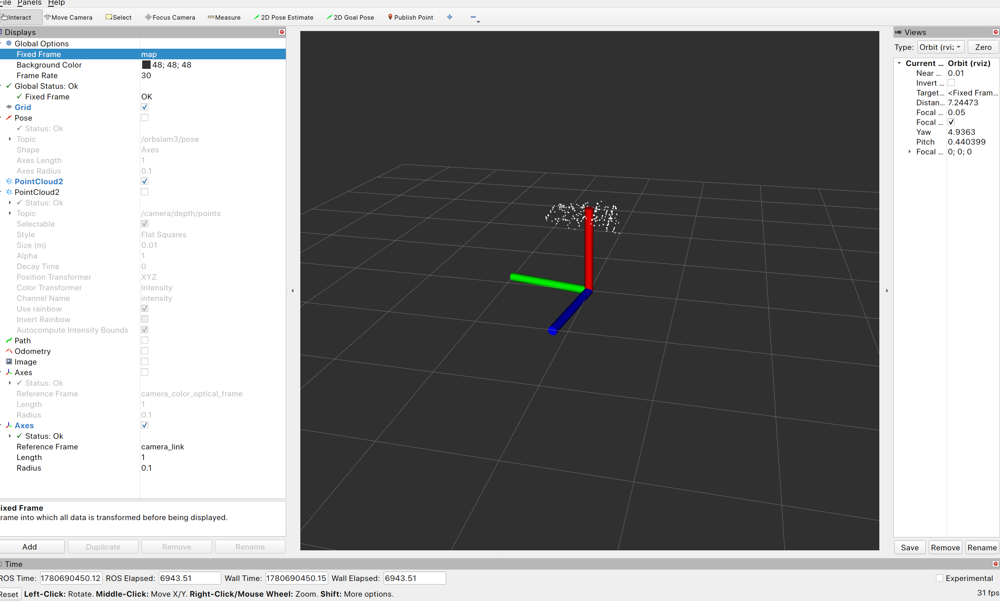
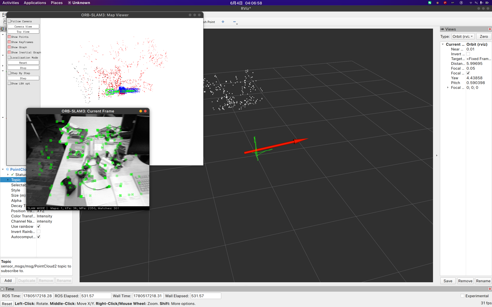
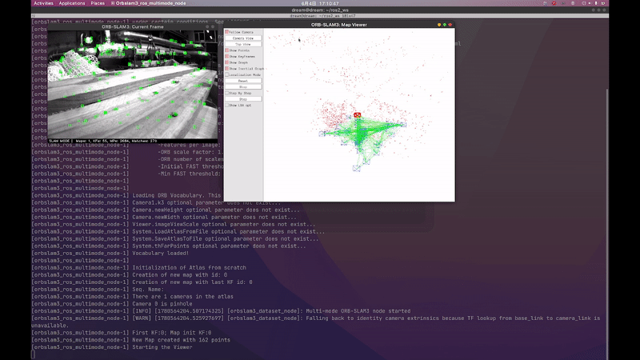
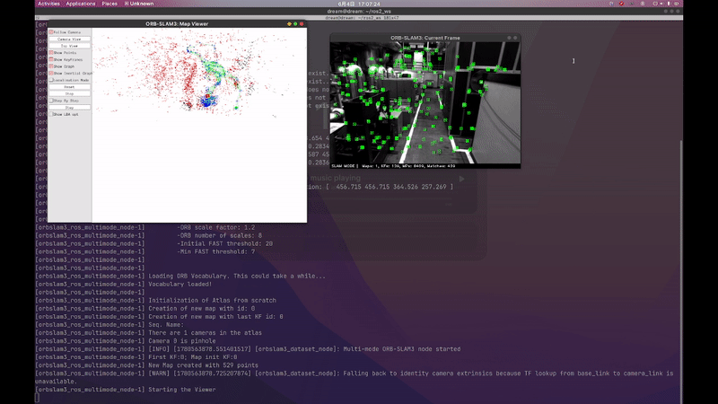
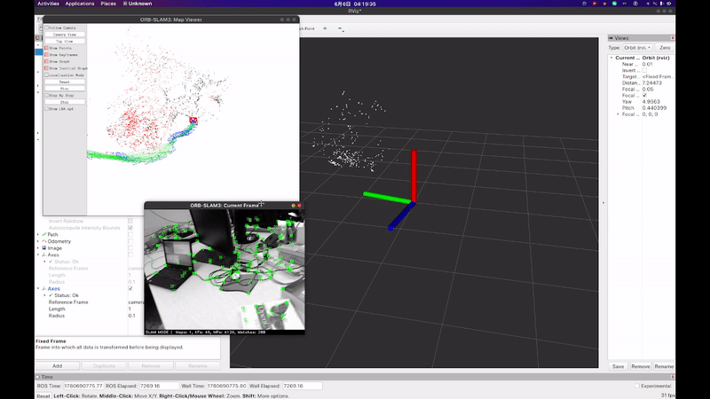
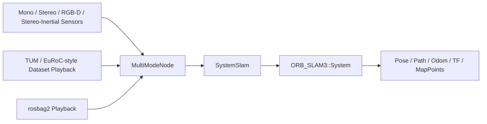
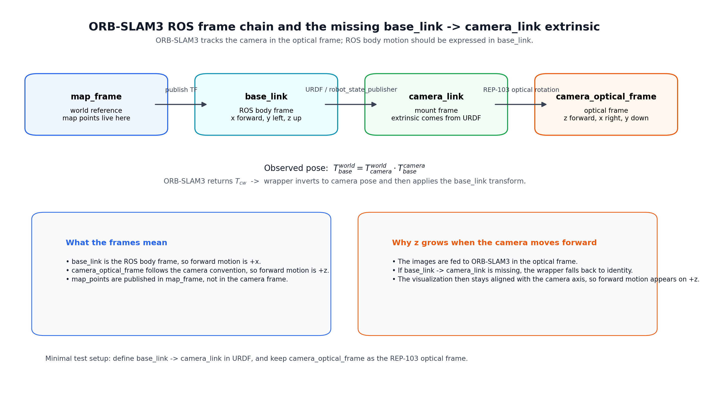

# orbslam3_ros

`orbslam3_ros` is a ROS 2 wrapper around ORB-SLAM3 for mono, stereo, RGB-D, and stereo-inertial tracking. It publishes pose, odometry, path, TF, tracking state, and sparse map points while keeping the ORB-SLAM3 integration in a small adapter layer.

Chinese version: [README_zh.md](README_zh.md)

<!-- Badges placeholder: CI, ROS distro, license, and build status badges go here. -->

## Overview

| Item | Details |
|---|---|
| Supported modes | mono, stereo, RGB-D, stereo-inertial |
| Input sources | live sensors, TUM/EuRoC/KITTI datasets, rosbag2 |
| Outputs | pose, odom, path, TF, sparse map points |
| Main entry points | realtime launch, dataset launch, generic launch |

## Visual Demo

### RViz



### ORB-SLAM3 Viewer



### GIF Previews

<table>
  <tr>
    <td align="center">
      <br>
      <strong>Monocular</strong><br>
      Single-camera tracking preview.
    </td>
    <td align="center">
      <br>
      <strong>Stereo</strong><br>
      Left-right image pair tracking preview.
    </td>
    <td align="center">
      <br>
      <strong>RGB-D</strong><br>
      Color-plus-depth tracking preview.
    </td>
  </tr>
</table>

## Highlights

### Included

- Monocular, stereo, RGB-D, and stereo-inertial realtime tracking
- File-sequence playback for mono/stereo/RGB-D/stereo-inertial datasets
- Optional rosbag2 playback through the generic launch file
- `geometry_msgs/msg/PoseStamped` pose output
- `nav_msgs/msg/Odometry`, `nav_msgs/msg/Path`, and tracking-state output
- `sensor_msgs/msg/PointCloud2` sparse map-point output for RViz and debugging
- Optional TF publishing
- Optional legacy pose inversion on `pose_topic`
- Launch-file driven parameter configuration
- A small C++ adapter around ORB-SLAM3

### Excluded

- Dense point-cloud reconstruction
- Occupancy or grid-map generation
- Sensor fusion with LiDAR or IMU
- Navigation or planning

## Architecture



| Layer | Responsibility |
|---|---|
| Sensors / Dataset Playback | Supplies live sensor frames or association-file playback input. |
| `MultiModeNode` | Declares parameters, selects the runtime mode, initializes SLAM, and manages runtime publishing. |
| `SystemSlam` | Adapts the ORB-SLAM3 API for mono, stereo, RGB-D, and stereo-inertial tracking. |
| `ORB_SLAM3::System` | Runs the underlying SLAM pipeline. |
| Output layer | Publishes pose, odometry, path, tracking state, sparse map points, and TF. |

## Prerequisites

### Target Environment

| Component | Version / requirement | Notes |
|---|---|---|
| Ubuntu | 22.04 | Tested target in this repository. |
| ROS 2 | Humble | Current launch and build instructions are written for Humble. |
| OpenCV | Compatible system install | Must match the ORB-SLAM3 build. |
| Compiler | C++17 compiler, GCC or Clang | Built with `-Wall -Wextra -Wpedantic`. |
| ORB-SLAM3 | Local source build | Built separately and linked from a local path. |

### ROS Dependencies

| Package | Purpose |
|---|---|
| `rclcpp` | Node and executor API |
| `rcl_interfaces` | Parameter descriptors |
| `sensor_msgs` | Image, camera info, and point cloud messages |
| `std_msgs` | Tracking state output |
| `message_filters` | RGB-D synchronization |
| `image_transport` | Image transport handling |
| `compressed_image_transport` | Compressed RGB transport support |
| `compressed_depth_image_transport` | Compressed depth transport support |
| `cv_bridge` | OpenCV and ROS image conversion |
| `geometry_msgs` | Pose and transform messages |
| `tf2` | TF math and lookup helpers |
| `tf2_ros` | TF publishing and listening |
| `nav_msgs` | Odometry and path messages |
| `launch` | ROS 2 launch support |
| `launch_ros` | ROS 2 node launch actions |

### Third-Party Dependencies

| Package | Purpose |
|---|---|
| `ORB-SLAM3` | Core SLAM system |
| `Pangolin` | Viewer support |
| `Sophus` | SE(3) math |
| `OpenCV` | Image processing |
| `Eigen3` | Linear algebra |
| `Boost.Serialization` | ORB-SLAM3 dependency |
| `OpenGL` | Viewer rendering |
| `GLEW` | OpenGL extension loading |
| `librealsense2` | Linked directly by the current CMake configuration |

`ORB-SLAM3`, `Pangolin`, and `Sophus` must be built separately before this package can be built.

The vocabulary file is not distributed with this repository. Please obtain `ORBvoc.txt` from the official ORB-SLAM3 project and place it under `vocabulary/ORBvoc.txt`.

## Quick Start

1. Install the ORB-SLAM3 prerequisites, then clone and build the fork used by this workspace:

   ```bash
   sudo apt update
   sudo apt install -y build-essential cmake git libopencv-dev libeigen3-dev libboost-serialization-dev libglew-dev

   mkdir -p ~/tools
   cd ~/tools
   git clone https://github.com/X-IOT-study/ORB_SLAM3.git ORB_SLAM3
   cd ORB_SLAM3
   chmod +x build.sh
   ./build.sh
   ```

   The checkout should point to your local `EndlessLoops/ORB_SLAM3` fork.

   This workspace expects the following ORB-SLAM3-related paths on your machine:

   - `ORB_SLAM3`: `<ORB_SLAM3_ROOT>`
   - `Pangolin`: `<PANGOLIN_BUILD_DIR>/src`
   - `Sophus`: `<ORB_SLAM3_ROOT>/Thirdparty/Sophus/build`
   - `realsense2`: `<ROS_HUMBLE_REALSENSE2_SO>`

2. Clone into a ROS 2 workspace:

   ```bash
   mkdir -p ~/ros2_ws/src
   cd ~/ros2_ws/src
   git clone https://github.com/X-IOT-study/orbslam3_ros.git orbslam3_ros
   ```

3. Build from the workspace root:

   ```bash
   source /opt/ros/humble/setup.bash
   cd ~/ros2_ws
   colcon build --packages-select orbslam3_ros --cmake-args -DCMAKE_BUILD_TYPE=Release
   source install/setup.bash
   ```

4. Launch the realtime or dataset entry point:

   ```bash
   ros2 launch orbslam3_ros orbslam3_realtime.launch.py
   ```

## Usage

### Realtime Modes

Use `orbslam3_realtime.launch.py` for live sensors. Select the mode with `mode:=...`.

Monocular:

```bash
ros2 launch orbslam3_ros orbslam3_realtime.launch.py \
  mode:=mono \
  image_topic:=/camera/image_raw \
  settings_file:=/path/to/orbslam3_ros/config/mono/TUM1.yaml
```

Stereo:

```bash
ros2 launch orbslam3_ros orbslam3_realtime.launch.py \
  mode:=stereo \
  left_topic:=/camera/left/image_raw \
  right_topic:=/camera/right/image_raw \
  settings_file:=/path/to/orbslam3_ros/config/stereo/EuRoC.yaml
```

RGB-D:

```bash
ros2 launch orbslam3_ros orbslam3_realtime.launch.py
```

Stereo-inertial:

```bash
ros2 launch orbslam3_ros orbslam3_realtime.launch.py \
  mode:=stereo_inertial \
  left_topic:=/camera/left/image_raw \
  right_topic:=/camera/right/image_raw \
  imu_topic:=/camera/imu \
  settings_file:=/path/to/orbslam3_ros/config/stereo_inertial/EuRoC.yaml
```

Common realtime options:

```bash
ros2 launch orbslam3_ros orbslam3_realtime.launch.py \
  image_transport:=compressed \
  depth_transport:=compressedDepth \
  runtime_calibration_from_camera_info:=true
```

### Dataset Playback

Use `orbslam3_dataset.launch.py` with a dataset family and the sequence root. The launch file auto-selects the matching settings template and generates the intermediate playback files when needed.

| Dataset family | Mode | One-liner |
|---|---|---|
| TUM | `rgbd` | `ros2 launch orbslam3_ros orbslam3_dataset.launch.py dataset_family:=tum dataset_root:=/home/dream/Datasets/TUM/rgbd_dataset_freiburg1_desk mode:=rgbd` |
| EuRoC | `mono` | `ros2 launch orbslam3_ros orbslam3_dataset.launch.py dataset_family:=euroc dataset_root:=/home/dream/Datasets/EuRoC/MH_01_easy mode:=mono` |
| KITTI | `stereo` | `ros2 launch orbslam3_ros orbslam3_dataset.launch.py dataset_family:=kitti dataset_root:=/path/to/sequences/00 mode:=stereo` |

Auto-detection also works when `dataset_family` is omitted, as long as `dataset_root` points at the sequence directory.

The launch file still accepts `association_file` and `imu_file` as expert overrides for custom layouts.
TUM RGB-D can use an existing `associations.txt`, or auto-generate one from `rgb.txt` and `depth.txt` when needed.

### Rosbag Playback

Use the generic launch file with `dataset_source:=bag`, `run_mode:=realtime`, and `bag_path:=/path/to/bag`:

```bash
ros2 launch orbslam3_ros orbslam3.launch.py \
  dataset_source:=bag \
  run_mode:=realtime \
  mode:=rgbd \
  bag_path:=/path/to/bag
```

### Compatibility Alias

The legacy `orbslam3_rgbd.launch.py` remains as a compatibility alias for the realtime RGB-D default:

```bash
ros2 launch orbslam3_ros orbslam3_rgbd.launch.py
```

## Interfaces

### Topics

| Topic | Type | Description |
|---|---|---|
| `/orbslam3/pose` | `geometry_msgs/msg/PoseStamped` | Pose output in the map frame. |
| `/orbslam3/odom` | `nav_msgs/msg/Odometry` | Odometry output with `base_frame` as the child frame. |
| `/orbslam3/path` | `nav_msgs/msg/Path` | Accumulated trajectory samples. |
| `/orbslam3/tracking_state` | `std_msgs/msg/UInt8` | ORB-SLAM3 tracking state encoded as `UInt8`. |
| `/orbslam3/map_points` | `sensor_msgs/msg/PointCloud2` | Tracked sparse map points for RViz and debugging. |

### TF

- `map_frame` or its legacy alias `world_frame` is the world reference frame.
- `map_frame -> base_frame` is published when `publish_tf:=true`.
- `base_frame -> camera_frame` is published only when `publish_static_camera_tf:=true`.
- `camera_frame -> camera_optical_frame` is published when `publish_static_optical_tf:=true`.
- The robot-to-camera transform is expected from URDF and `robot_state_publisher`.

### Coordinate Alignment



- ORB-SLAM3 returns the tracked camera pose (`Tcw`), and `orbslam3_ros` inverts it before publishing the pose.
- `map_points` are published in `map_frame`, so the sparse cloud belongs to the world frame, not to `base_link` or `camera_link`.
- `base_link` follows the ROS body convention (`x` forward, `y` left, `z` up).
- `camera_optical_frame` follows the camera convention (`z` forward, `x` right, `y` down), which is why forward motion can show up on `z` when the camera extrinsic is missing.

Minimal URDF for a connection test:

Ready-to-use file: [urdf/minimal_camera_test.urdf](urdf/minimal_camera_test.urdf)

```xml
<robot name="orbslam3_camera_test">
  <link name="base_link" />
  <link name="camera_link" />

  <joint name="base_link_to_camera_link" type="fixed">
    <parent link="base_link" />
    <child link="camera_link" />
    <origin xyz="0 0 0" rpy="0 0 0" />
  </joint>

  <!-- Keep this only if your camera driver does not already publish the optical frame. -->
  <link name="camera_optical_frame" />
  <joint name="camera_link_to_optical_frame" type="fixed">
    <parent link="camera_link" />
    <child link="camera_optical_frame" />
    <origin xyz="0 0 0" rpy="-1.57079632679 0 -1.57079632679" />
  </joint>
</robot>
```

- For a pure connection test, the zero transform is enough to verify that TF lookup works.
- For the Astra setup, keep the camera optical frames in the camera driver and set `camera_frame:=camera_color_optical_frame`.
- For real motion interpretation, replace the zero origin with the real camera mounting extrinsic.

Recommended one-shot test launch:

```bash
ros2 launch orbslam3_ros orbslam3_astra_test.launch.py
```

This launch starts `robot_state_publisher`, `astra_camera`, and `orbslam3_ros` together. The defaults assume `camera_name:=camera` and use `urdf/minimal_camera_test.urdf`.

For dataset playback in a body frame, use:

```bash
ros2 launch orbslam3_ros orbslam3_dataset_bodyframe.launch.py
```

That launch uses `urdf/minimal_dataset_camera_test.urdf` and keeps the output aligned to `base_link` x-forward.

### Trajectory Files

Dataset playback saves `CameraTrajectory.txt` and `KeyFrameTrajectory.txt` in `dataset_root`; if you only provide `association_file`, they are saved in that file's directory.

## Parameters

Defaults below follow the launch files. Use `orbslam3_realtime.launch.py` and `orbslam3_dataset.launch.py` for the common cases; use `orbslam3.launch.py` when you want to mix and match mode, run mode, and data source directly.

### Input Parameters

| Parameter | Default | Description |
|---|---|---|
| `vocab_file` | `share/orbslam3_ros/vocabulary/ORBvoc.txt` | ORB vocabulary file. |
| `settings_file` | Auto-selects the matching `share/orbslam3_ros/config/<family>/<mode>/...` file when omitted | ORB-SLAM3 settings file. Override it when you want a custom calibration or non-default dataset. |
| `dataset_family` | `auto` | Dataset family used by the offline launcher. Auto-detects from `dataset_root` when possible. |
| `dataset_root` | empty | Sequence root directory used for dataset auto-detection, settings selection, and trajectory output. |
| `rgb_topic` | `/camera/color/image_raw` | RGB image base topic. |
| `depth_topic` | `/camera/depth/image_raw` | Depth image base topic. |
| `rgb_camera_info_topic` | `/camera/color/camera_info` | RGB camera info topic. |
| `image_transport` | `raw` | RGB image transport plugin. |
| `depth_transport` | `raw` | Depth image transport plugin. |
| `queue_size` | `10` | Legacy compatibility queue size. |
| `sync_queue_size` | `10` | Approximate-time synchronizer queue size. |
| `frame_queue_size` | `10` | Bounded SPSC frame queue size. |
| `sync_tolerance_sec` | `0.05` | Maximum RGB/depth timestamp delta in seconds. |
| `stats_hz` | `1.0` | Diagnostic log frequency in Hz. |
| `map_points_rate` | `30.0` | Map points publish frequency in Hz. |
| `path_history_size` | `200` | Maximum number of path samples to retain. |
| `path_update_distance` | `0.05` | Minimum translation required before appending a new path sample. |
| `path_update_interval` | `0.1` | Maximum path sampling interval in seconds. |
| `diagnostic_logging` | `false` | Enables verbose node-side diagnostics. |
| `publish_tf` | `true` | Enables TF output. |
| `publish_static_camera_tf` | `false` | Publishes a fallback static `base_frame -> camera_frame` transform. |
| `publish_static_optical_tf` | `false` | Publishes `camera_frame -> camera_optical_frame`. |
| `invert_pose` | `false` | Inverts the published pose for legacy compatibility. |

### Output Parameters

| Parameter | Default | Description |
|---|---|---|
| `pose_topic` | `/orbslam3/pose` | Pose output topic. |
| `odom_topic` | `/orbslam3/odom` | Odometry output topic. |
| `path_topic` | `/orbslam3/path` | Path output topic. |
| `tracking_state_topic` | `/orbslam3/tracking_state` | Tracking state output topic. |
| `map_points_topic` | `/orbslam3/map_points` | Sparse map points output topic. |

### Frame Parameters

| Parameter | Default | Description |
|---|---|---|
| `map_frame` | `map` | Frame used for pose and TF output. |
| `world_frame` | `map` | Legacy alias for `map_frame`. |
| `base_frame` | `base_link` | Robot base frame used for odometry and TF output. |
| `camera_frame` | `camera_link` | Camera frame used for TF output. |
| `camera_optical_frame` | `camera_optical_frame` | REP-103 optical frame used for the static camera transform. |

### Viewer Parameters

| Parameter | Default | Description |
|---|---|---|
| `use_viewer` | `true` | Enables the ORB-SLAM3 viewer. |

Notes:

- The ORB-SLAM3 viewer can stay black while `tracking_state` is `Initializing`; it becomes useful after the first map is built and tracking turns `Tracking`.
- `diagnostic_logging:=true` prints the initialization phase, waiting conditions, and state transitions.
- `base_link -> camera_link` should come from URDF or `robot_state_publisher`; otherwise the node falls back to identity extrinsics for visualization.

### Mode Parameters

| Parameter | Default | Description |
|---|---|---|
| `mode` | `rgbd` | Selects mono, stereo, rgbd, or stereo_inertial. |
| `run_mode` | `realtime` | Chooses live subscriptions or file-sequence playback. |
| `dataset_source` | `sequence` | Set to `bag` to play a rosbag alongside the live node. |
| `association_file` | empty | Expert override for the dataset sequence file used in playback mode. |
| `imu_file` | empty | Expert override for the IMU file used by stereo-inertial dataset playback. |
| `loop` | `false` | Replays the dataset in a loop. |
| `playback_rate` | `1.0` | Playback speed multiplier applied to dataset timestamps. |

## Project Layout

```text
orbslam3_ros/
├── CMakeLists.txt
├── package.xml
├── README.md
├── README_zh.md
├── config/
│   ├── TUM1.yaml
│   └── astra_pro.yaml
│   ├── mono/
│   ├── rgbd/
│   ├── stereo/
│   └── stereo_inertial/
├── include/
│   ├── ORB_SLAM3/System.h
│   └── orbslam3_ros/
│       ├── node_base.hpp
│       ├── multimode_node.hpp
│       ├── pose_snapshot.hpp
│       ├── publishers.hpp
│       ├── slam/
│       │   └── system_slam.hpp
│       ├── rgbd_dataset_node.hpp
│       ├── rgbd_node.hpp
│       ├── rgbd_slam.hpp
│       ├── spsc_ring_buffer.hpp
│       └── tum_dataset_loader.hpp
├── launch/
│   ├── orbslam3_astra_test.launch.py
│   ├── orbslam3_dataset_bodyframe.launch.py
│   ├── orbslam3.launch.py
│   ├── orbslam3_dataset.launch.py
│   ├── orbslam3_realtime.launch.py
│   └── orbslam3_rgbd.launch.py
├── urdf/
│   ├── minimal_dataset_camera_test.urdf
│   └── minimal_camera_test.urdf
├── src/
│   ├── dataset/
│   │   └── tum_dataset_loader.cpp
│   ├── node/
│   │   ├── main.cpp
│   │   ├── main_dataset.cpp
│   │   ├── main_multimode.cpp
│   │   ├── multimode_node.cpp
│   │   ├── node_base.cpp
│   │   ├── publishers.cpp
│   │   ├── rgbd_dataset_node.cpp
│   │   └── rgbd_node.cpp
│   └── slam/
│       ├── rgbd_slam.cpp
│       └── system_slam.cpp
└── vocabulary/
```

## Acknowledgements

This project builds on ORB-SLAM3 by Carlos Campos, Richard Elvira, Juan J. Gómez Rodríguez, José M. M. Montiel, and Juan D. Tardós, along with the broader ORB-SLAM work from the University of Zaragoza.

## License

This project is released under the GPL-3.0 License.

ORB-SLAM3 is developed by the University of Zaragoza and distributed under GPL-3.0. This repository only provides a ROS 2 wrapper and does not redistribute the ORB-SLAM3 source code.
