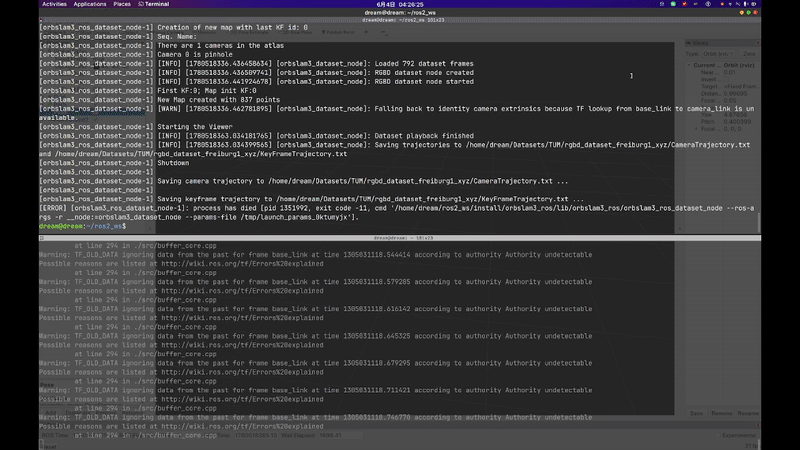
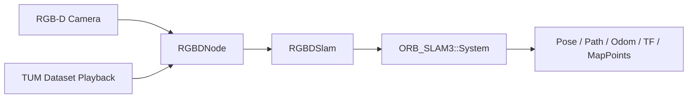

# orbslam3_ros

`orbslam3_ros` is a ROS 2 wrapper around ORB-SLAM3 for RGB-D localization and TUM-style dataset playback. It publishes pose, odometry, path, TF, tracking state, and sparse map points while keeping the ORB-SLAM3 integration in a small adapter layer.

Chinese version: [README_zh.md](README_zh.md)

<!-- Badges placeholder: CI, ROS distro, license, and build status badges go here. -->

## Demo

### RViz


### ORB-SLAM3 Viewer


### GIF



## Quick Start

1. Install the ORB-SLAM3 prerequisites, then clone and build the fork used by this workspace:

   ```bash
   sudo apt update
   sudo apt install -y build-essential cmake git libopencv-dev libeigen3-dev libboost-serialization-dev libglew-dev

   mkdir -p ~/tools
   cd ~/tools
   git clone https://github.com/EndlessLoops/ORB_SLAM3 ORB_SLAM3
   cd ORB_SLAM3
   chmod +x build.sh
   ./build.sh
   ```

   The checkout at `/home/dream/tools/ORB_SLAM3` points to the `EndlessLoops/ORB_SLAM3` repository.

   This workspace expects the following local ORB-SLAM3-related paths:

   - `ORB_SLAM3`: `/home/dream/tools/ORB_SLAM3`
   - `Pangolin`: `/home/dream/tools/Pangolin/build/src`
   - `Sophus`: `/home/dream/tools/ORB_SLAM3/Thirdparty/Sophus/build`
   - `realsense2`: `/opt/ros/humble/lib/x86_64-linux-gnu/librealsense2.so.2.57`

2. Clone into a ROS 2 workspace:

   ```bash
   mkdir -p ~/ros2_ws/src
   cd ~/ros2_ws/src
   git clone https://github.com/X-IOT-study/orbslam3_ros.git orbslam3_ros
   ```

3. Build from the workspace root:

   ```bash
   source /opt/ros/humble/setup.bash
   cd ~/ros2_ws
   colcon build --packages-select orbslam3_ros --cmake-args -DCMAKE_BUILD_TYPE=Release
   source install/setup.bash
   ```

4. Launch the unified RGB-D entry point:

   ```bash
   ros2 launch orbslam3_ros orbslam3_rgbd.launch.py mode:=realtime
   ```

## Features

### What It Provides

- RGB-D realtime tracking
- TUM association-file playback
- `geometry_msgs/msg/PoseStamped` pose output
- `nav_msgs/msg/Odometry`, `nav_msgs/msg/Path`, and tracking-state output
- `sensor_msgs/msg/PointCloud2` sparse map-point output for RViz and debugging
- Optional TF publishing
- Optional legacy pose inversion on `pose_topic`
- Launch-file driven parameter configuration
- A small C++ adapter around ORB-SLAM3

### What It Does Not Provide

- Dense point-cloud reconstruction
- Occupancy or grid-map generation
- Sensor fusion with LiDAR or IMU
- Navigation or planning

## Architecture



| Layer | Responsibility |
|---|---|
| RGB-D Camera / Dataset Playback | Supplies live RGB-D frames or association-file playback input. |
| `RGBDNode` | Declares parameters, validates files and camera info, synchronizes RGB-D input, initializes SLAM, and manages runtime publishing. |
| `RGBDSlam` | Adapts the ORB-SLAM3 API for RGB-D tracking and trajectory export. |
| `ORB_SLAM3::System` | Runs the underlying SLAM pipeline. |
| Output layer | Publishes pose, odometry, path, tracking state, sparse map points, and TF. |

The realtime node consumes live camera topics. The dataset node follows the same output path, but reads TUM association files instead of a live camera stream.

## Tested Environment

| Component | Version / requirement | Notes |
|---|---|---|
| Ubuntu | 22.04 | Tested target in this repository. |
| ROS 2 | Humble | Current launch and build instructions are written for Humble. |
| OpenCV | Compatible system install | Must match the ORB-SLAM3 build. |
| Compiler | C++17 compiler, GCC or Clang | Built with `-Wall -Wextra -Wpedantic`. |
| ORB-SLAM3 | Local source build | Built separately and linked from a local path. |

## Dependencies

### ROS Dependencies

| Package | Purpose |
|---|---|
| `rclcpp` | Node and executor API |
| `rcl_interfaces` | Parameter descriptors |
| `sensor_msgs` | Image, camera info, and point cloud messages |
| `std_msgs` | Tracking state output |
| `message_filters` | RGB-D synchronization |
| `image_transport` | Image transport handling |
| `compressed_image_transport` | Compressed RGB transport support |
| `compressed_depth_image_transport` | Compressed depth transport support |
| `cv_bridge` | OpenCV and ROS image conversion |
| `geometry_msgs` | Pose and transform messages |
| `tf2` | TF math and lookup helpers |
| `tf2_ros` | TF publishing and listening |
| `nav_msgs` | Odometry and path messages |
| `launch` | ROS 2 launch support |
| `launch_ros` | ROS 2 node launch actions |

### Third-Party Dependencies

| Package | Purpose |
|---|---|
| `ORB-SLAM3` | Core SLAM system |
| `Pangolin` | Viewer support |
| `Sophus` | SE(3) math |
| `OpenCV` | Image processing |
| `Eigen3` | Linear algebra |
| `Boost.Serialization` | ORB-SLAM3 dependency |
| `OpenGL` | Viewer rendering |
| `GLEW` | OpenGL extension loading |
| `librealsense2` | Linked directly by the current CMake configuration |

`ORB-SLAM3`, `Pangolin`, and `Sophus` must be built separately before this package can be built.

The vocabulary file is not distributed with this repository. Please obtain `ORBvoc.txt` from the official ORB-SLAM3 project and place it under `vocabulary/ORBvoc.txt`.

## Usage

### Realtime RGB-D

```bash
ros2 launch orbslam3_ros orbslam3_realtime.launch.py
```

Compressed streams:

```bash
ros2 launch orbslam3_ros orbslam3_realtime.launch.py image_transport:=compressed depth_transport:=compressedDepth
```

### Dataset Playback

```bash
ros2 launch orbslam3_ros orbslam3_dataset.launch.py association_file:=/path/to/associations.txt
```

### Unified Launch Entry

```bash
ros2 launch orbslam3_ros orbslam3_rgbd.launch.py mode:=realtime
ros2 launch orbslam3_ros orbslam3_rgbd.launch.py mode:=dataset association_file:=/path/to/associations.txt
```

## ROS Interfaces

### Topics

| Topic | Type | Description |
|---|---|---|
| `/orbslam3/pose` | `geometry_msgs/msg/PoseStamped` | Pose output in the map frame. |
| `/orbslam3/odom` | `nav_msgs/msg/Odometry` | Odometry output with `base_frame` as the child frame. |
| `/orbslam3/path` | `nav_msgs/msg/Path` | Accumulated trajectory samples. |
| `/orbslam3/tracking_state` | `std_msgs/msg/UInt8` | ORB-SLAM3 tracking state encoded as `UInt8`. |
| `/orbslam3/map_points` | `sensor_msgs/msg/PointCloud2` | Tracked sparse map points for RViz and debugging. |

### TF

- `map_frame` or its legacy alias `world_frame` is the world reference frame.
- `map_frame -> base_frame` is published when `publish_tf:=true`.
- `base_frame -> camera_frame` is published only when `publish_static_camera_tf:=true`.
- `camera_frame -> camera_optical_frame` is published when `publish_static_optical_tf:=true`.
- The robot-to-camera transform is expected from URDF and `robot_state_publisher`.

### Trajectory Files

Dataset playback saves `CameraTrajectory.txt` and `KeyFrameTrajectory.txt` in the directory that contains the association file.

## Parameters

Defaults below follow the launch files.

### Input Parameters

| Parameter | Default | Description |
|---|---|---|
| `vocab_file` | `share/orbslam3_ros/vocabulary/ORBvoc.txt` | ORB vocabulary file. |
| `settings_file` | `share/orbslam3_ros/config/astra_pro.yaml` or `share/orbslam3_ros/config/TUM1.yaml` | ORB-SLAM3 settings file. Realtime and dataset launch files use different defaults. |
| `rgb_topic` | `/camera/color/image_raw` | RGB image base topic. |
| `depth_topic` | `/camera/depth/image_raw` | Depth image base topic. |
| `rgb_camera_info_topic` | `/camera/color/camera_info` | RGB camera info topic. |
| `image_transport` | `raw` | RGB image transport plugin. |
| `depth_transport` | `raw` | Depth image transport plugin. |
| `queue_size` | `10` | Legacy compatibility queue size. |
| `sync_queue_size` | `10` | Approximate-time synchronizer queue size. |
| `frame_queue_size` | `10` | Bounded SPSC frame queue size. |
| `sync_tolerance_sec` | `0.05` | Maximum RGB/depth timestamp delta in seconds. |
| `stats_hz` | `1.0` | Diagnostic log frequency in Hz. |
| `map_points_rate` | `30.0` | Map points publish frequency in Hz. |
| `path_history_size` | `200` | Maximum number of path samples to retain. |
| `path_update_distance` | `0.05` | Minimum translation required before appending a new path sample. |
| `path_update_interval` | `0.1` | Maximum path sampling interval in seconds. |
| `diagnostic_logging` | `false` | Enables verbose node-side diagnostics. |
| `publish_tf` | `true` | Enables TF output. |
| `publish_static_camera_tf` | `false` | Publishes a fallback static `base_frame -> camera_frame` transform. |
| `publish_static_optical_tf` | `false` | Publishes `camera_frame -> camera_optical_frame`. |
| `invert_pose` | `false` | Inverts the published pose for legacy compatibility. |

### Output Parameters

| Parameter | Default | Description |
|---|---|---|
| `pose_topic` | `/orbslam3/pose` | Pose output topic. |
| `odom_topic` | `/orbslam3/odom` | Odometry output topic. |
| `path_topic` | `/orbslam3/path` | Path output topic. |
| `tracking_state_topic` | `/orbslam3/tracking_state` | Tracking state output topic. |
| `map_points_topic` | `/orbslam3/map_points` | Sparse map points output topic. |

### Frame Parameters

| Parameter | Default | Description |
|---|---|---|
| `map_frame` | `map` | Frame used for pose and TF output. |
| `world_frame` | `map` | Legacy alias for `map_frame`. |
| `base_frame` | `base_link` | Robot base frame used for odometry and TF output. |
| `camera_frame` | `camera_link` | Camera frame used for TF output. |
| `camera_optical_frame` | `camera_optical_frame` | REP-103 optical frame used for the static camera transform. |

### Viewer Parameters

| Parameter | Default | Description |
|---|---|---|
| `use_viewer` | `true` | Enables the ORB-SLAM3 viewer. |

### Dataset Parameters

| Parameter | Default | Description |
|---|---|---|
| `mode` | `realtime` | Selects the unified launch entry point mode. |
| `association_file` | empty | TUM association file used in dataset mode. |
| `loop` | `false` | Replays the dataset in a loop. |
| `playback_rate` | `1.0` | Playback speed multiplier applied to dataset timestamps. |

## Repository Layout

```text
orbslam3_ros/
├── CMakeLists.txt
├── package.xml
├── README.md
├── README_zh.md
├── config/
│   ├── TUM1.yaml
│   └── astra_pro.yaml
├── include/
│   ├── ORB_SLAM3/System.h
│   └── orbslam3_ros/
│       ├── node_base.hpp
│       ├── pose_snapshot.hpp
│       ├── publishers.hpp
│       ├── rgbd_dataset_node.hpp
│       ├── rgbd_node.hpp
│       ├── rgbd_slam.hpp
│       ├── spsc_ring_buffer.hpp
│       └── tum_dataset_loader.hpp
├── launch/
│   ├── orbslam3_dataset.launch.py
│   ├── orbslam3_realtime.launch.py
│   └── orbslam3_rgbd.launch.py
├── src/
│   ├── dataset/
│   │   └── tum_dataset_loader.cpp
│   ├── node/
│   │   ├── main.cpp
│   │   ├── main_dataset.cpp
│   │   ├── node_base.cpp
│   │   ├── publishers.cpp
│   │   ├── rgbd_dataset_node.cpp
│   │   └── rgbd_node.cpp
│   └── slam/
│       └── rgbd_slam.cpp
└── vocabulary/
```

## Acknowledgements

This project builds on ORB-SLAM3 by Carlos Campos, Richard Elvira, Juan J. Gómez Rodríguez, José M. M. Montiel, and Juan D. Tardós, along with the broader ORB-SLAM work from the University of Zaragoza.

## License

This project is released under the GPL-3.0 License.

ORB-SLAM3 is developed by the University of Zaragoza and distributed under GPL-3.0. This repository only provides a ROS 2 wrapper and does not redistribute the ORB-SLAM3 source code.
