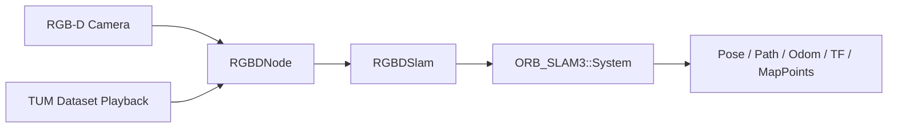

# orbslam3_ros

`orbslam3_ros` 是一个用于 RGB-D 定位和 TUM 风格数据集回放的 ROS 2 ORB-SLAM3 封装包。它发布位姿、里程计、路径、TF、tracking state 和稀疏地图点，并将 ORB-SLAM3 集成保持在一个较小的适配层中。

English version: [README.md](README.md)

<!-- 占位：CI、ROS 发行版、许可证和构建状态徽章可放在这里。 -->

## 演示

### RViz


### ORB-SLAM3 Viewer


### GIF


## 快速开始

1. 安装 ORB-SLAM3 先决条件，然后克隆并编译本工作区使用的 fork：

   ```bash
   sudo apt update
   sudo apt install -y build-essential cmake git libopencv-dev libeigen3-dev libboost-serialization-dev libglew-dev

   mkdir -p ~/tools
   cd ~/tools
   git clone https://github.com/EndlessLoops/ORB_SLAM3 ORB_SLAM3
   cd ORB_SLAM3
   chmod +x build.sh
   ./build.sh
   ```

   `/home/dream/tools/ORB_SLAM3` 这个目录对应的是 `EndlessLoops/ORB_SLAM3` 仓库。

   本工作区当前预期使用的本地 ORB-SLAM3 相关路径如下：

   - `ORB_SLAM3`: `/home/dream/tools/ORB_SLAM3`
   - `Pangolin`: `/home/dream/tools/Pangolin/build/src`
   - `Sophus`: `/home/dream/tools/ORB_SLAM3/Thirdparty/Sophus/build`
   - `realsense2`: `/opt/ros/humble/lib/x86_64-linux-gnu/librealsense2.so.2.57`

2. 克隆到 ROS 2 工作空间：

   ```bash
   mkdir -p ~/ros2_ws/src
   cd ~/ros2_ws/src
   git clone https://github.com/X-IOT-study/orbslam3_ros.git orbslam3_ros
   ```

3. 在工作空间根目录编译：

   ```bash
   source /opt/ros/humble/setup.bash
   cd ~/ros2_ws
   colcon build --packages-select orbslam3_ros --cmake-args -DCMAKE_BUILD_TYPE=Release
   source install/setup.bash
   ```

4. 启动统一 RGB-D 入口：

   ```bash
   ros2 launch orbslam3_ros orbslam3_rgbd.launch.py mode:=realtime
   ```

## 功能

### 提供什么

- RGB-D 实时跟踪
- TUM association 文件回放
- `geometry_msgs/msg/PoseStamped` 位姿输出
- `nav_msgs/msg/Odometry`、`nav_msgs/msg/Path` 和 tracking state 输出
- `sensor_msgs/msg/PointCloud2` 稀疏地图点输出，用于 RViz 和调试
- 可选 TF 发布
- 可选的旧式位姿反转功能，作用于 `pose_topic`
- 通过 launch 文件进行参数配置
- 一层轻量的 ORB-SLAM3 C++ 适配器

### 不提供什么

- 稠密点云重建
- 占据栅格或栅格地图生成
- 与激光雷达或 IMU 的传感器融合
- 导航或路径规划

## 架构



| 层级 | 职责 |
|---|---|
| RGB-D Camera / Dataset Playback | 提供实时 RGB-D 帧或 association 文件回放输入。 |
| `RGBDNode` | 声明参数、校验文件和相机信息、同步 RGB-D 输入、初始化 SLAM，并管理运行时发布。 |
| `RGBDSlam` | 封装 ORB-SLAM3 API，用于 RGB-D 跟踪和轨迹导出。 |
| `ORB_SLAM3::System` | 运行底层 SLAM 流程。 |
| 输出层 | 发布位姿、里程计、路径、tracking state、稀疏地图点和 TF。 |

实时节点消费的是在线相机话题。数据集节点走同一套输出路径，但读取的是 TUM association 文件，而不是实时相机流。

## 测试环境

| 组件 | 版本 / 要求 | 说明 |
|---|---|---|
| Ubuntu | 22.04 | 本仓库的测试目标环境。 |
| ROS 2 | Humble | 当前编译和启动说明基于 Humble。 |
| OpenCV | 系统已安装且兼容 | 需要与 ORB-SLAM3 的构建保持一致。 |
| 编译器 | C++17 编译器，GCC 或 Clang | 使用 `-Wall -Wextra -Wpedantic` 编译。 |
| ORB-SLAM3 | 本地源码构建 | 需要单独构建，并从本地路径链接。 |

## 依赖

### ROS 依赖

| 包 | 用途 |
|---|---|
| `rclcpp` | 节点和 executor API |
| `rcl_interfaces` | 参数描述符 |
| `sensor_msgs` | 图像、相机信息和点云消息 |
| `std_msgs` | tracking state 输出 |
| `message_filters` | RGB-D 同步 |
| `image_transport` | 图像传输处理 |
| `compressed_image_transport` | 压缩 RGB 传输支持 |
| `compressed_depth_image_transport` | 压缩深度传输支持 |
| `cv_bridge` | OpenCV 与 ROS 图像转换 |
| `geometry_msgs` | 位姿和变换消息 |
| `tf2` | TF 数学与查找辅助 |
| `tf2_ros` | TF 发布与监听 |
| `nav_msgs` | 里程计和路径消息 |
| `launch` | ROS 2 launch 支持 |
| `launch_ros` | ROS 2 节点 launch 动作 |

### 第三方依赖

| 包 | 用途 |
|---|---|
| `ORB-SLAM3` | 核心 SLAM 系统 |
| `Pangolin` | Viewer 支持 |
| `Sophus` | SE(3) 数学 |
| `OpenCV` | 图像处理 |
| `Eigen3` | 线性代数 |
| `Boost.Serialization` | ORB-SLAM3 依赖 |
| `OpenGL` | Viewer 渲染 |
| `GLEW` | OpenGL 扩展加载 |
| `librealsense2` | 当前 CMake 配置直接链接的库 |

`ORB-SLAM3`、`Pangolin` 和 `Sophus` 必须先单独构建，然后这个包才能编译。

词典文件不随本仓库发布。请从官方 ORB-SLAM3 项目获取 `ORBvoc.txt`，并将其放到 `vocabulary/ORBvoc.txt`。

## 使用

### 实时 RGB-D

```bash
ros2 launch orbslam3_ros orbslam3_realtime.launch.py
```

压缩流：

```bash
ros2 launch orbslam3_ros orbslam3_realtime.launch.py image_transport:=compressed depth_transport:=compressedDepth
```

### 数据集回放

```bash
ros2 launch orbslam3_ros orbslam3_dataset.launch.py association_file:=/path/to/associations.txt
```

### 统一启动入口

```bash
ros2 launch orbslam3_ros orbslam3_rgbd.launch.py mode:=realtime
ros2 launch orbslam3_ros orbslam3_rgbd.launch.py mode:=dataset association_file:=/path/to/associations.txt
```

## ROS 接口

### 话题

| 话题 | 类型 | 说明 |
|---|---|---|
| `/orbslam3/pose` | `geometry_msgs/msg/PoseStamped` | map 坐标系下的位姿输出。 |
| `/orbslam3/odom` | `nav_msgs/msg/Odometry` | 以 `base_frame` 为子坐标系的里程计输出。 |
| `/orbslam3/path` | `nav_msgs/msg/Path` | 累积轨迹采样。 |
| `/orbslam3/tracking_state` | `std_msgs/msg/UInt8` | 用 `UInt8` 编码的 ORB-SLAM3 tracking state。 |
| `/orbslam3/map_points` | `sensor_msgs/msg/PointCloud2` | 用于 RViz 和调试的稀疏地图点。 |

### TF

- `map_frame` 或其旧别名 `world_frame` 是世界参考坐标系。
- 当 `publish_tf:=true` 时，发布 `map_frame -> base_frame`。
- 当 `publish_static_camera_tf:=true` 时，才会发布 `base_frame -> camera_frame`。
- 当 `publish_static_optical_tf:=true` 时，发布 `camera_frame -> camera_optical_frame`。
- 机器人到相机的外参应由 URDF 和 `robot_state_publisher` 提供。

### 轨迹文件

数据集回放结束后，会把 `CameraTrajectory.txt` 和 `KeyFrameTrajectory.txt` 保存到 association 文件所在目录。

## 参数

下面的默认值与 launch 文件保持一致。

### 输入参数

| 参数 | 默认值 | 说明 |
|---|---|---|
| `vocab_file` | `share/orbslam3_ros/vocabulary/ORBvoc.txt` | ORB 词典文件。 |
| `settings_file` | `share/orbslam3_ros/config/astra_pro.yaml` 或 `share/orbslam3_ros/config/TUM1.yaml` | ORB-SLAM3 配置文件。实时和数据集 launch 使用不同默认值。 |
| `rgb_topic` | `/camera/color/image_raw` | RGB 图像基础话题。 |
| `depth_topic` | `/camera/depth/image_raw` | 深度图像基础话题。 |
| `rgb_camera_info_topic` | `/camera/color/camera_info` | RGB 相机信息话题。 |
| `image_transport` | `raw` | RGB 图像传输插件。 |
| `depth_transport` | `raw` | 深度图像传输插件。 |
| `queue_size` | `10` | 旧兼容队列长度。 |
| `sync_queue_size` | `10` | 近似时间同步器队列长度。 |
| `frame_queue_size` | `10` | 有界 SPSC 帧队列长度。 |
| `sync_tolerance_sec` | `0.05` | RGB/深度时间戳最大差值，单位秒。 |
| `stats_hz` | `1.0` | 诊断日志频率，单位 Hz。 |
| `map_points_rate` | `30.0` | 地图点发布频率，单位 Hz。 |
| `path_history_size` | `200` | 保留的路径采样最大数量。 |
| `path_update_distance` | `0.05` | 路径新增采样前所需的最小位移。 |
| `path_update_interval` | `0.1` | 路径采样的最大间隔，单位秒。 |
| `diagnostic_logging` | `false` | 是否启用更详细的节点诊断日志。 |
| `publish_tf` | `true` | 是否启用 TF 输出。 |
| `publish_static_camera_tf` | `false` | 是否发布备用静态 `base_frame -> camera_frame` 变换。 |
| `publish_static_optical_tf` | `false` | 是否发布 `camera_frame -> camera_optical_frame`。 |
| `invert_pose` | `false` | 为兼容旧行为而反转发布的位姿。 |

### 输出参数

| 参数 | 默认值 | 说明 |
|---|---|---|
| `pose_topic` | `/orbslam3/pose` | 位姿输出话题。 |
| `odom_topic` | `/orbslam3/odom` | 里程计输出话题。 |
| `path_topic` | `/orbslam3/path` | 路径输出话题。 |
| `tracking_state_topic` | `/orbslam3/tracking_state` | tracking state 输出话题。 |
| `map_points_topic` | `/orbslam3/map_points` | 稀疏地图点输出话题。 |

### 坐标系参数

| 参数 | 默认值 | 说明 |
|---|---|---|
| `map_frame` | `map` | 用于位姿和 TF 输出的坐标系。 |
| `world_frame` | `map` | `map_frame` 的旧别名。 |
| `base_frame` | `base_link` | 用于里程计和 TF 输出的机器人基坐标系。 |
| `camera_frame` | `camera_link` | 用于 TF 输出的相机坐标系。 |
| `camera_optical_frame` | `camera_optical_frame` | 供静态相机变换使用的 REP-103 光学坐标系。 |

### Viewer 参数

| 参数 | 默认值 | 说明 |
|---|---|---|
| `use_viewer` | `true` | 是否启用 ORB-SLAM3 Viewer。 |

### 数据集参数

| 参数 | 默认值 | 说明 |
|---|---|---|
| `mode` | `realtime` | 统一启动入口的模式选择。 |
| `association_file` | 为空 | 数据集模式使用的 TUM association 文件。 |
| `loop` | `false` | 是否循环回放数据集。 |
| `playback_rate` | `1.0` | 作用于数据集时间戳的回放速度倍率。 |

## 仓库结构

```text
orbslam3_ros/
├── CMakeLists.txt
├── package.xml
├── README.md
├── README_zh.md
├── config/
│   ├── TUM1.yaml
│   └── astra_pro.yaml
├── include/
│   ├── ORB_SLAM3/System.h
│   └── orbslam3_ros/
│       ├── node_base.hpp
│       ├── pose_snapshot.hpp
│       ├── publishers.hpp
│       ├── rgbd_dataset_node.hpp
│       ├── rgbd_node.hpp
│       ├── rgbd_slam.hpp
│       ├── spsc_ring_buffer.hpp
│       └── tum_dataset_loader.hpp
├── launch/
│   ├── orbslam3_dataset.launch.py
│   ├── orbslam3_realtime.launch.py
│   └── orbslam3_rgbd.launch.py
├── src/
│   ├── dataset/
│   │   └── tum_dataset_loader.cpp
│   ├── node/
│   │   ├── main.cpp
│   │   ├── main_dataset.cpp
│   │   ├── node_base.cpp
│   │   ├── publishers.cpp
│   │   ├── rgbd_dataset_node.cpp
│   │   └── rgbd_node.cpp
│   └── slam/
│       └── rgbd_slam.cpp
└── vocabulary/
```

## 致谢

本项目基于 ORB-SLAM3 及其作者 Carlos Campos、Richard Elvira、Juan J. Gómez Rodríguez、José M. M. Montiel 和 Juan D. Tardós 的工作，以及萨拉戈萨大学的 ORB-SLAM 相关研究。

## 许可证

本项目以 GPL-3.0 许可证发布。

ORB-SLAM3 由萨拉戈萨大学开发，并以 GPL-3.0 方式分发。本仓库仅提供 ROS 2 wrapper，不重新分发 ORB-SLAM3 源代码。
