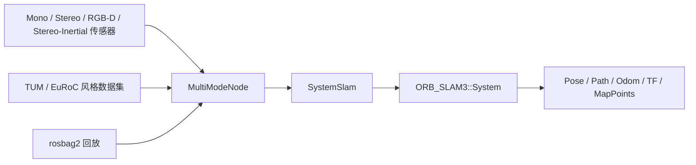

# orbslam3_ros

`orbslam3_ros` 是一个用于 mono、stereo、RGB-D 和 stereo-inertial 定位的 ROS 2 ORB-SLAM3 封装包。它发布位姿、里程计、路径、TF、tracking state 和稀疏地图点，并将 ORB-SLAM3 集成保持在一个较小的适配层中。

English version: [README.md](README.md)

<!-- 占位：CI、ROS 发行版、许可证和构建状态徽章可放在这里。 -->

## 总览

| 项目 | 说明 |
|---|---|
| 支持模式 | mono、stereo、RGB-D、stereo-inertial |
| 输入来源 | 实时传感器、TUM/EuRoC/KITTI 数据集、rosbag2 |
| 输出内容 | 位姿、里程计、路径、TF、稀疏地图点 |
| 主要入口 | realtime launch、dataset launch、通用 launch |

## 视觉展示

### RViz


### ORB-SLAM3 Viewer


### GIF 预演

<table>
  <tr>
    <td align="center">
      <br>
      <strong>单目</strong><br>
      单相机跟踪预演。
    </td>
    <td align="center">
      <br>
      <strong>双目</strong><br>
      左右图像对跟踪预演。
    </td>
    <td align="center">
      <br>
      <strong>RGB-D</strong><br>
      颜色 + 深度跟踪预演。
    </td>
  </tr>
</table>

## 亮点

### 包含内容

- mono / stereo / RGB-D / stereo-inertial 实时跟踪
- mono / stereo / RGB-D / stereo-inertial 文件序列回放
- 通过通用 launch 支持 rosbag2 回放
- `geometry_msgs/msg/PoseStamped` 位姿输出
- `nav_msgs/msg/Odometry`、`nav_msgs/msg/Path` 和 tracking state 输出
- `sensor_msgs/msg/PointCloud2` 稀疏地图点输出，用于 RViz 和调试
- 可选 TF 发布
- 可选的旧式位姿反转功能，作用于 `pose_topic`
- 通过 launch 文件进行参数配置
- 一层轻量的 ORB-SLAM3 C++ 适配器

### 不包含内容

- 稠密点云重建
- 占据栅格或栅格地图生成
- 与激光雷达或 IMU 的传感器融合
- 导航或路径规划

## 架构



| 层级 | 职责 |
|---|---|
| 传感器 / 数据集回放 | 提供实时传感器帧或 association 文件回放输入。 |
| `MultiModeNode` | 声明参数、选择运行模式、初始化 SLAM，并管理运行时发布。 |
| `SystemSlam` | 封装 ORB-SLAM3 API，用于 mono、stereo、RGB-D 和 stereo-inertial 跟踪。 |
| `ORB_SLAM3::System` | 运行底层 SLAM 流程。 |
| 输出层 | 发布位姿、里程计、路径、tracking state、稀疏地图点和 TF。 |

## 先决条件

### 目标环境

| 组件 | 版本 / 要求 | 说明 |
|---|---|---|
| Ubuntu | 22.04 | 本仓库的测试目标环境。 |
| ROS 2 | Humble | 当前编译和启动说明基于 Humble。 |
| OpenCV | 系统已安装且兼容 | 需要与 ORB-SLAM3 的构建保持一致。 |
| 编译器 | C++17 编译器，GCC 或 Clang | 使用 `-Wall -Wextra -Wpedantic` 编译。 |
| ORB-SLAM3 | 本地源码构建 | 需要单独构建，并从本地路径链接。 |

### ROS 依赖

| 包 | 用途 |
|---|---|
| `rclcpp` | 节点和 executor API |
| `rcl_interfaces` | 参数描述符 |
| `sensor_msgs` | 图像、相机信息和点云消息 |
| `std_msgs` | tracking state 输出 |
| `message_filters` | RGB-D 同步 |
| `image_transport` | 图像传输处理 |
| `compressed_image_transport` | 压缩 RGB 传输支持 |
| `compressed_depth_image_transport` | 压缩深度传输支持 |
| `cv_bridge` | OpenCV 与 ROS 图像转换 |
| `geometry_msgs` | 位姿和变换消息 |
| `tf2` | TF 数学与查找辅助 |
| `tf2_ros` | TF 发布与监听 |
| `nav_msgs` | 里程计和路径消息 |
| `launch` | ROS 2 launch 支持 |
| `launch_ros` | ROS 2 节点 launch 动作 |

### 第三方依赖

| 包 | 用途 |
|---|---|
| `ORB-SLAM3` | 核心 SLAM 系统 |
| `Pangolin` | Viewer 支持 |
| `Sophus` | SE(3) 数学 |
| `OpenCV` | 图像处理 |
| `Eigen3` | 线性代数 |
| `Boost.Serialization` | ORB-SLAM3 依赖 |
| `OpenGL` | Viewer 渲染 |
| `GLEW` | OpenGL 扩展加载 |
| `librealsense2` | 当前 CMake 配置直接链接的库 |

`ORB-SLAM3`、`Pangolin` 和 `Sophus` 必须先单独构建，然后这个包才能编译。

词典文件不随本仓库发布。请从官方 ORB-SLAM3 项目获取 `ORBvoc.txt`，并将其放到 `vocabulary/ORBvoc.txt`。

## 快速开始

1. 安装 ORB-SLAM3 先决条件，然后克隆并编译本工作区使用的 fork：

   ```bash
   sudo apt update
   sudo apt install -y build-essential cmake git libopencv-dev libeigen3-dev libboost-serialization-dev libglew-dev

   mkdir -p ~/tools
   cd ~/tools
   git clone https://github.com/X-IOT-study/ORB_SLAM3.git ORB_SLAM3
   cd ORB_SLAM3
   chmod +x build.sh
   ./build.sh
   ```

   这个 checkout 应该指向你本机的 `EndlessLoops/ORB_SLAM3` fork。

   本工作区预期使用的 ORB-SLAM3 相关路径如下，请按你的机器实际位置替换：

   - `ORB_SLAM3`: `<ORB_SLAM3_ROOT>`
   - `Pangolin`: `<PANGOLIN_BUILD_DIR>/src`
   - `Sophus`: `<ORB_SLAM3_ROOT>/Thirdparty/Sophus/build`
   - `realsense2`: `<ROS_HUMBLE_REALSENSE2_SO>`

2. 克隆到 ROS 2 工作空间：

   ```bash
   mkdir -p ~/ros2_ws/src
   cd ~/ros2_ws/src
   git clone https://github.com/X-IOT-study/orbslam3_ros.git orbslam3_ros
   ```

3. 在工作空间根目录编译：

   ```bash
   source /opt/ros/humble/setup.bash
   cd ~/ros2_ws
   colcon build --packages-select orbslam3_ros --cmake-args -DCMAKE_BUILD_TYPE=Release
   source install/setup.bash
   ```

4. 启动实时或数据集入口：

   ```bash
   ros2 launch orbslam3_ros orbslam3_realtime.launch.py
   ```

## 使用

### 实时模式

实时传感器请使用 `orbslam3_realtime.launch.py`，并通过 `mode:=...` 选择模式。

单目：

```bash
ros2 launch orbslam3_ros orbslam3_realtime.launch.py \
  mode:=mono \
  image_topic:=/camera/image_raw \
  settings_file:=/path/to/orbslam3_ros/config/mono/TUM1.yaml
```

双目：

```bash
ros2 launch orbslam3_ros orbslam3_realtime.launch.py \
  mode:=stereo \
  left_topic:=/camera/left/image_raw \
  right_topic:=/camera/right/image_raw \
  settings_file:=/path/to/orbslam3_ros/config/stereo/EuRoC.yaml
```

RGB-D：

```bash
ros2 launch orbslam3_ros orbslam3_realtime.launch.py
```

Stereo-inertial：

```bash
ros2 launch orbslam3_ros orbslam3_realtime.launch.py \
  mode:=stereo_inertial \
  left_topic:=/camera/left/image_raw \
  right_topic:=/camera/right/image_raw \
  imu_topic:=/camera/imu \
  settings_file:=/path/to/orbslam3_ros/config/stereo_inertial/EuRoC.yaml
```

通用实时参数示例：

```bash
ros2 launch orbslam3_ros orbslam3_realtime.launch.py \
  image_transport:=compressed \
  depth_transport:=compressedDepth \
  runtime_calibration_from_camera_info:=true
```

### 数据集回放

使用 `orbslam3_dataset.launch.py` 时，优先提供数据集家族和序列根目录。launch 会自动选择匹配的 settings，并在需要时生成中间回放文件。

| 数据集家族 | 模式 | 一条命令 |
|---|---|---|
| TUM | `rgbd` | `ros2 launch orbslam3_ros orbslam3_dataset.launch.py dataset_family:=tum dataset_root:=/home/dream/Datasets/TUM/rgbd_dataset_freiburg1_desk mode:=rgbd` |
| EuRoC | `mono` | `ros2 launch orbslam3_ros orbslam3_dataset.launch.py dataset_family:=euroc dataset_root:=/home/dream/Datasets/EuRoC/MH_01_easy mode:=mono` |
| KITTI | `stereo` | `ros2 launch orbslam3_ros orbslam3_dataset.launch.py dataset_family:=kitti dataset_root:=/path/to/sequences/00 mode:=stereo` |

如果省略 `dataset_family`，launch 会在 `dataset_root` 指向序列目录时自动识别。

`association_file` 和 `imu_file` 仍保留为高级覆盖参数，方便自定义目录布局。
TUM RGB-D 既支持直接使用 `associations.txt`，也会在只有 `rgb.txt` 和 `depth.txt` 时自动生成配对文件。

### Rosbag 回放

使用通用 launch，并设置 `dataset_source:=bag`、`run_mode:=realtime` 和 `bag_path:=/path/to/bag`：

```bash
ros2 launch orbslam3_ros orbslam3.launch.py \
  dataset_source:=bag \
  run_mode:=realtime \
  mode:=rgbd \
  bag_path:=/path/to/bag
```

### 兼容别名

旧的 `orbslam3_rgbd.launch.py` 仍保留为 realtime RGB-D 的兼容别名：

```bash
ros2 launch orbslam3_ros orbslam3_rgbd.launch.py
```

## 接口

### 话题

| 话题 | 类型 | 说明 |
|---|---|---|
| `/orbslam3/pose` | `geometry_msgs/msg/PoseStamped` | map 坐标系下的位姿输出。 |
| `/orbslam3/odom` | `nav_msgs/msg/Odometry` | 以 `base_frame` 为子坐标系的里程计输出。 |
| `/orbslam3/path` | `nav_msgs/msg/Path` | 累积轨迹采样。 |
| `/orbslam3/tracking_state` | `std_msgs/msg/UInt8` | 用 `UInt8` 编码的 ORB-SLAM3 tracking state。 |
| `/orbslam3/map_points` | `sensor_msgs/msg/PointCloud2` | 用于 RViz 和调试的稀疏地图点。 |

### TF

- `map_frame` 或其旧别名 `world_frame` 是世界参考坐标系。
- 当 `publish_tf:=true` 时，发布 `map_frame -> base_frame`。
- 当 `publish_static_camera_tf:=true` 时，才会发布 `base_frame -> camera_frame`。
- 当 `publish_static_optical_tf:=true` 时，发布 `camera_frame -> camera_optical_frame`。
- 机器人到相机的外参应由 URDF 和 `robot_state_publisher` 提供。

### 坐标对齐


- ORB-SLAM3 返回的是相机跟踪位姿 `Tcw`，`orbslam3_ros` 会先取逆，再发布位姿。
- `map_points` 发布在 `map_frame` 中，所以稀疏点云属于世界坐标系，而不是 `base_link` 或 `camera_link`。
- `base_link` 采用 ROS 机体坐标系约定：`x` 向前、`y` 向左、`z` 向上。
- `camera_optical_frame` 采用相机坐标系约定：`z` 向前、`x` 向右、`y` 向下；因此当外参缺失时，相机前进会看起来像 `z` 在增长。

用于连接测试的最小 URDF：

可直接使用的文件：[urdf/minimal_camera_test.urdf](urdf/minimal_camera_test.urdf)

```xml
<robot name="orbslam3_camera_test">
  <link name="base_link" />
  <link name="camera_link" />

  <joint name="base_link_to_camera_link" type="fixed">
    <parent link="base_link" />
    <child link="camera_link" />
    <origin xyz="0 0 0" rpy="0 0 0" />
  </joint>

  <!-- 如果相机驱动已经发布光学坐标系，这一段可以省略。 -->
  <link name="camera_optical_frame" />
  <joint name="camera_link_to_optical_frame" type="fixed">
    <parent link="camera_link" />
    <child link="camera_optical_frame" />
    <origin xyz="0 0 0" rpy="-1.57079632679 0 -1.57079632679" />
  </joint>
</robot>
```

- 仅做连通性测试时，零位姿就足够验证 TF 查找是否正常。
- 对 Astra 这套相机，建议把 optical 坐标系留给相机驱动，并将 `camera_frame:=camera_color_optical_frame`。
- 真正要解释运动方向时，请把 `origin` 改成真实的相机安装外参。

推荐的一键测试启动方式：

```bash
ros2 launch orbslam3_ros orbslam3_astra_test.launch.py
```

这个 launch 会同时启动 `robot_state_publisher`、`astra_camera` 和 `orbslam3_ros`。默认使用 `camera_name:=camera`，并读取 `urdf/minimal_camera_test.urdf`。

如果你要让 dataset 回放也统一成 `base_link` 的 x 前 body frame，请用：

```bash
ros2 launch orbslam3_ros orbslam3_dataset_bodyframe.launch.py
```

它会读取 `urdf/minimal_dataset_camera_test.urdf`，把 dataset 输出也对齐到 `base_link` 的 x 轴。

### 轨迹文件

数据集回放结束后，会把 `CameraTrajectory.txt` 和 `KeyFrameTrajectory.txt` 保存到 `dataset_root`；如果只提供了 `association_file`，则保存到该文件所在目录。

## 参数

下面的默认值与 launch 文件保持一致。常用场景建议直接用 `orbslam3_realtime.launch.py` 和 `orbslam3_dataset.launch.py`；需要混搭 mode / run_mode / 数据源时再使用通用 launch。

### 输入参数

| 参数 | 默认值 | 说明 |
|---|---|---|
| `vocab_file` | `share/orbslam3_ros/vocabulary/ORBvoc.txt` | ORB 词典文件。 |
| `settings_file` | 省略时会自动选择与 `dataset_family` 和 `mode` 匹配的 `share/orbslam3_ros/config/<family>/<mode>/...` 文件 | ORB-SLAM3 配置文件。需要自定义标定或非默认数据集时再覆盖。 |
| `dataset_family` | `auto` | 离线 launch 使用的数据集家族；可从 `dataset_root` 自动识别。 |
| `dataset_root` | 为空 | 序列根目录，用于自动识别数据集、选择 settings，并作为轨迹输出目录。 |
| `rgb_topic` | `/camera/color/image_raw` | RGB 图像基础话题。 |
| `depth_topic` | `/camera/depth/image_raw` | 深度图像基础话题。 |
| `rgb_camera_info_topic` | `/camera/color/camera_info` | RGB 相机信息话题。 |
| `image_transport` | `raw` | RGB 图像传输插件。 |
| `depth_transport` | `raw` | 深度图像传输插件。 |
| `queue_size` | `10` | 旧兼容队列长度。 |
| `sync_queue_size` | `10` | 近似时间同步器队列长度。 |
| `frame_queue_size` | `10` | 有界 SPSC 帧队列长度。 |
| `sync_tolerance_sec` | `0.05` | RGB/深度时间戳最大差值，单位秒。 |
| `stats_hz` | `1.0` | 诊断日志频率，单位 Hz。 |
| `map_points_rate` | `30.0` | 地图点发布频率，单位 Hz。 |
| `path_history_size` | `200` | 保留的路径采样最大数量。 |
| `path_update_distance` | `0.05` | 路径新增采样前所需的最小位移。 |
| `path_update_interval` | `0.1` | 路径采样的最大间隔，单位秒。 |
| `diagnostic_logging` | `false` | 是否启用更详细的节点诊断日志。 |
| `publish_tf` | `true` | 是否启用 TF 输出。 |
| `publish_static_camera_tf` | `false` | 是否发布备用静态 `base_frame -> camera_frame` 变换。 |
| `publish_static_optical_tf` | `false` | 是否发布 `camera_frame -> camera_optical_frame`。 |
| `invert_pose` | `false` | 为兼容旧行为而反转发布的位姿。 |

### 输出参数

| 参数 | 默认值 | 说明 |
|---|---|---|
| `pose_topic` | `/orbslam3/pose` | 位姿输出话题。 |
| `odom_topic` | `/orbslam3/odom` | 里程计输出话题。 |
| `path_topic` | `/orbslam3/path` | 路径输出话题。 |
| `tracking_state_topic` | `/orbslam3/tracking_state` | tracking state 输出话题。 |
| `map_points_topic` | `/orbslam3/map_points` | 稀疏地图点输出话题。 |

### 坐标系参数

| 参数 | 默认值 | 说明 |
|---|---|---|
| `map_frame` | `map` | 用于位姿和 TF 输出的坐标系。 |
| `world_frame` | `map` | `map_frame` 的旧别名。 |
| `base_frame` | `base_link` | 用于里程计和 TF 输出的机器人基坐标系。 |
| `camera_frame` | `camera_link` | 用于 TF 输出的相机坐标系。 |
| `camera_optical_frame` | `camera_optical_frame` | 供静态相机变换使用的 REP-103 光学坐标系。 |

### Viewer 参数

| 参数 | 默认值 | 说明 |
|---|---|---|
| `use_viewer` | `true` | 是否启用 ORB-SLAM3 Viewer。 |

说明：

- 当 `tracking_state` 还是 `Initializing` 时，ORB-SLAM3 Viewer 可能会保持黑屏，这是初始建图阶段的正常现象。
- 打开 `diagnostic_logging:=true` 后，会看到初始化等待条件、初始化尝试和状态切换日志。
- `base_link -> camera_link` 最好由 URDF 或 `robot_state_publisher` 提供；否则节点会退回到 identity 外参并给出警告。

### 模式参数

| 参数 | 默认值 | 说明 |
|---|---|---|
| `mode` | `rgbd` | 选择 mono、stereo、rgbd 或 stereo_inertial。 |
| `run_mode` | `realtime` | 选择实时订阅或文件序列回放。 |
| `dataset_source` | `sequence` | 设为 `bag` 时，通用 launch 会同时启动 rosbag2。 |
| `association_file` | 为空 | 回放模式使用的序列文件覆盖项。 |
| `imu_file` | 为空 | stereo-inertial 数据集回放使用的 IMU 文件覆盖项。 |
| `loop` | `false` | 是否循环回放数据集。 |
| `playback_rate` | `1.0` | 作用于数据集时间戳的回放速度倍率。 |

## 项目结构

```text
orbslam3_ros/
├── CMakeLists.txt
├── package.xml
├── README.md
├── README_zh.md
├── config/
│   ├── TUM1.yaml
│   └── astra_pro.yaml
│   ├── mono/
│   ├── rgbd/
│   ├── stereo/
│   └── stereo_inertial/
├── include/
│   ├── ORB_SLAM3/System.h
│   └── orbslam3_ros/
│       ├── node_base.hpp
│       ├── multimode_node.hpp
│       ├── pose_snapshot.hpp
│       ├── publishers.hpp
│       ├── slam/
│       │   └── system_slam.hpp
│       ├── rgbd_dataset_node.hpp
│       ├── rgbd_node.hpp
│       ├── rgbd_slam.hpp
│       ├── spsc_ring_buffer.hpp
│       └── tum_dataset_loader.hpp
├── launch/
│   ├── orbslam3_astra_test.launch.py
│   ├── orbslam3_dataset_bodyframe.launch.py
│   ├── orbslam3.launch.py
│   ├── orbslam3_dataset.launch.py
│   ├── orbslam3_realtime.launch.py
│   └── orbslam3_rgbd.launch.py
├── urdf/
│   ├── minimal_dataset_camera_test.urdf
│   └── minimal_camera_test.urdf
├── src/
│   ├── dataset/
│   │   └── tum_dataset_loader.cpp
│   ├── node/
│   │   ├── main.cpp
│   │   ├── main_dataset.cpp
│   │   ├── main_multimode.cpp
│   │   ├── multimode_node.cpp
│   │   ├── node_base.cpp
│   │   ├── publishers.cpp
│   │   ├── rgbd_dataset_node.cpp
│   │   └── rgbd_node.cpp
│   └── slam/
│       ├── rgbd_slam.cpp
│       └── system_slam.cpp
└── vocabulary/
```

## 致谢

本项目基于 ORB-SLAM3 及其作者 Carlos Campos、Richard Elvira、Juan J. Gómez Rodríguez、José M. M. Montiel 和 Juan D. Tardós 的工作，以及萨拉戈萨大学的 ORB-SLAM 相关研究。

## 许可证

本项目以 GPL-3.0 许可证发布。

ORB-SLAM3 由萨拉戈萨大学开发，并以 GPL-3.0 方式分发。本仓库仅提供 ROS 2 wrapper，不重新分发 ORB-SLAM3 源代码。
